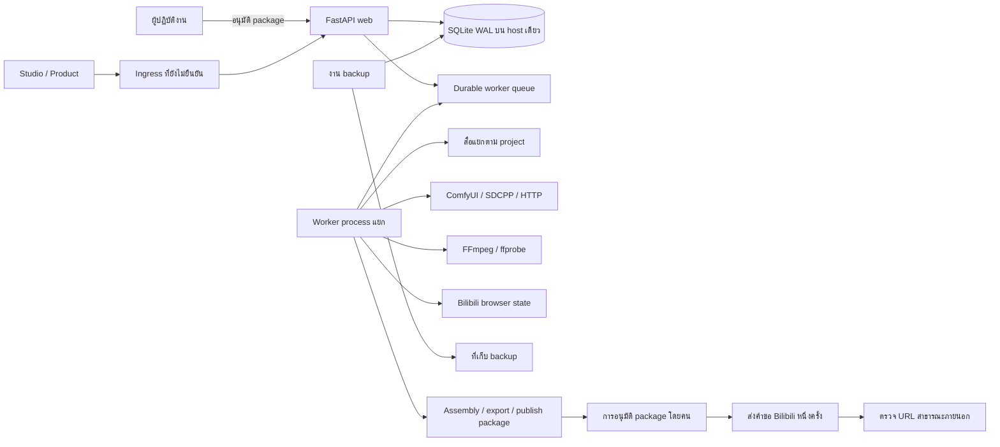

# การตรวจความพร้อมก่อนใช้งานจริงของ zMovie

**วันที่ตรวจ:** 23 กันยายน 2026 UTC  
**Repository:** `cvsz/zmovie`  
**SHA ที่ใช้เป็น baseline:** `0c2607f754c2f56b92c2999689e12deec7f04c26`  
**SHA ของ HEAD บน feature branch:** `0c2607f754c2f56b92c2999689e12deec7f04c26`; การแก้ไขยังไม่ได้ commit  
**สาขาทำงาน:** `codex/production-readiness-20260923` โดยเริ่มจาก `origin/main`  
**ขอบเขตหลักฐาน:** ตรวจ source, รัน regression suite และ startup ท้องถิ่นแบบแยกข้อมูล ไม่มีหลักฐานจาก staging, production host, model จริง, การเผยแพร่สาธารณะ หรือ DR restore

ข้อความคำขอระบุวันที่ตรวจ baseline เป็น 24 กันยายน 2026 แต่วันที่ของสภาพแวดล้อมคือ 23 กันยายน 2026 จึงใช้วันที่ของสภาพแวดล้อมในรายงานนี้ การแก้ไขทั้งหมดอยู่ใน worktree แยกจาก checkout เดิมและไม่ได้เปลี่ยน repository อื่น

## ภาพสถาปัตยกรรม



Web และ worker ใช้ SQLite ไฟล์เดียวบน host เดียว การตั้งค่านี้ไม่ใช่ distributed HA และไม่รองรับ SQLite บน SMB/NFS เป็น writer หลาย host การ submit ต่อ Bilibili ต้องผ่านการอนุมัติ package ก่อน และสถานะ `submitted` ยังไม่ยืนยันว่าเผยแพร่ต่อสาธารณะแล้ว

## แบบจำลองภัยคุกคามและขอบเขตความเชื่อถือ

| ขอบเขต | ข้อมูล/ผู้เกี่ยวข้อง | ภัยคุกคามและการควบคุม |
| --- | --- | --- |
| Browser และ API client → web | คำขอ, token, project ID, asset ID และข้อมูล Product Plan | ถือ input และ ID จาก client ว่าไม่น่าเชื่อถือ ตรวจ authentication, owner, role, schema และขนาดคำขอทุกครั้ง; Product Plan ยังคง public พร้อม rate limit ต่อ process |
| เครือข่าย → first-user bootstrap | สร้างผู้ดูแลคนแรกและลงนาม token | ปิด bootstrap จากเครือข่าย; การตั้งค่าแบบ local ต้อง bind และเชื่อมต่อจาก loopback พร้อม flag ที่เปิดชัด; provisioning ผ่าน environment file ที่จำกัดสิทธิ์ |
| Web/worker → SQLite และ filesystem | account, project, queue, media, export และ audit | DB และ local volume เป็นข้อมูลอำนาจหลักบน host เดียว; แยก media ตาม project และตรวจ canonical path; worker มีสิทธิ์เข้าถึงข้อมูลที่จำเป็นต่อหลาย project จึงต้องแยก OS identity และ mount ให้แคบลงก่อน production |
| Worker → provider ภายนอก | prompt, provider response, ComfyUI URL, browser session ของ Bilibili | ถือ response และสถานะเครือข่ายว่าเชื่อถือไม่ได้; provider egress ยังไม่มี allowlist; ambiguous Bilibili submit เข้าสู่ `recovery_required` และไม่ retry อัตโนมัติ; browser state เป็น credential |
| Backup → ที่เก็บสำรอง/restore host | DB, project metadata, media และ credentials ตามตำแหน่งติดตั้ง | backup มีข้อมูลอ่อนไหว ต้องจำกัดสิทธิ์และเข้ารหัสเมื่อส่งออก; ยังไม่มีหลักฐาน offsite restore, hash validation บน clean host หรือ RPO/RTO |
| ผู้ดูแล → approval/publication | package hash, account/session และการ submit ภายนอก | การอนุมัติต้องอ้าง package ที่ hash ตรงกัน; ห้ามอนุมาน `submitted` ว่า `published`; การยืนยันต้องตรวจ public URL แยกต่างหาก |

## ความหมายของสถานะหลักฐาน

- **พบบั๊กและทำซ้ำได้:** สร้างสภาพปัญหาบน baseline ด้วย DB หรือไฟล์ชั่วคราวได้
- **พบจุดเสี่ยงใน source:** ต้องทดสอบกับ deployment จริงก่อนสรุปผล
- **ข้อจำกัดด้านแบบ:** เป็นข้อจำกัดที่ทราบ ไม่ใช่ผลทดสอบที่ผ่าน
- **หลักฐาน runtime ยังขาด:** unit test หรือ config ไม่พิสูจน์บริการจริง

## โมเดลความเสี่ยงและผลแก้ไข

| ID / ระดับ | หลักฐานและความเสี่ยง | การแก้ไขในสาขานี้ | หลักฐาน/งานที่ยังเหลือ |
| --- | --- | --- | --- |
| AUTH-01 / P0 | **พบบั๊กและทำซ้ำได้บน baseline:** เมื่อไม่มีบัญชี/key, endpoint first-user bootstrap สร้าง admin และคืน token ได้; signing fallback แบบเดิมไม่ได้เป็น secret ถาวร | startup ปฏิเสธ key ที่หาย/อ่อนเมื่อ bind ออกนอก loopback, ปฏิเสธ auth-off บน network bind, ปฏิเสธรหัส admin เริ่มต้นอ่อน; bootstrap HTTP ใช้ได้เฉพาะเมื่อ bind และ peer เป็น loopback พร้อม flag ที่เปิดชัดเจน; การสร้าง admin ทำใน `BEGIN IMMEDIATE`; role และ token version อ่านจาก DB ทุก request; logout และเปลี่ยนรหัสตัด token เดิม | startup deny และ local bootstrap ทดสอบแล้ว; การอ่าน env file ที่ติดตั้งจริงและ proxy ingress ยังต้องตรวจบน host อ้างอิง: [auth.py:65](../zmovie_platform/auth.py#L65), [api_routes.py:101](../zmovie_platform/api_routes.py#L101), [test_security_boundaries.py:267](../tests/test_security_boundaries.py#L267) |
| ASSET-01 / P0 | **พบบั๊กและทำซ้ำได้บน baseline:** Project A ผูก path media ของ Project B ได้ผ่าน managed root ร่วม และ preview อาจอ่าน bytes ได้ | ตรวจ path ภายใต้ `root/project_id`, ปฏิเสธ traversal, symlink และ hardlink; asset response ไม่ส่ง path/metadata; preview token ผูก audience/project/asset อายุสั้นผ่าน HttpOnly/SameSite cookie; ตรวจสิทธิ์และเจ้าของซ้ำตอนอ่าน; final selection และ production export ตรวจ project scope | regression ทดสอบ register/list/preview, expiry, logout, owner change, deletion, byte range และ final export; การย้าย asset เดิมจาก root ที่ไม่มี project scope และ race ระหว่างตรวจ path กับเปิดไฟล์ยังไม่ปิด อ้างอิง: [security.py:84](../zmovie_platform/security.py#L84), [api_routes.py:298](../zmovie_platform/api_routes.py#L298), [media_preview.py:23](../zmovie_platform/media_preview.py#L23), [test_media_preview.py:121](../tests/test_media_preview.py#L121) |
| AUTH-02 / P1 | JWT audience/version และ role เดิมต้องสอดคล้องกับบัญชีปัจจุบัน | token ใหม่ระบุ audience, expiry และ version; token เก่าที่ไม่มี audience ยังรับได้จนหมดอายุเพื่อ compatibility | ยังไม่มีนโยบายยุติ token legacy โดยวันกำหนด; ตรวจ password rotation แล้ว แต่การจัดการ role ต้องทดสอบผ่านช่องทาง admin จริง อ้างอิง: [auth.py:180](../zmovie_platform/auth.py#L180), [test_security_boundaries.py:351](../tests/test_security_boundaries.py#L351) |
| JOB-01 / P1 | worker job details เดิมอาจค้นด้วย ID โดยไม่ตรวจ project | endpoint ตรวจ project owner; job ที่ไม่ผูก project เป็น admin-only; queue summary เป็น admin-only; response ไม่คืน payload/result/path | regression direct-route ผ่าน; hosted API E2E ยังไม่รัน อ้างอิง: [production_routes.py:195](../zmovie_platform/production_routes.py#L195), [test_security_boundaries.py:384](../tests/test_security_boundaries.py#L384) |
| QUEUE-01 / P1 | completion/failure เก่าของ worker อาจไม่มี lease fencing ครบ | claim เพิ่ม `lease_epoch`; running/heartbeat/complete/fail ตรวจ worker, epoch, expected state และเวลาหมด lease; stale worker ถูกปฏิเสธ; จำนวนงานและ retry/backoff ถูกจำกัด | ทดสอบ claim พร้อมกัน, reclaim และ worker เก่าที่พยายาม complete/fail; ยังไม่ทำ SIGKILL/reboot, heartbeat สูญหายจริง, low disk, provider timeout หรือภาระหลาย worker ระยะยาว อ้างอิง: [worker_queue.py:240](../zmovie_platform/worker_queue.py#L240), [test_worker_queue.py:57](../tests/test_worker_queue.py#L57) |
| QUEUE-02 / P1 | render เก่าใช้ BackgroundTasks/process-local; production run และ job อาจเขียนแยก transaction | legacy shot/project render ใช้ durable queue; production run และ worker row ถูกสร้าง transaction เดียว; Idempotency-Key รองรับ production run, render route และ publication request | `POST /api/v2/pipeline` ยังคงทำงานใน request process; cancellation, dead-letter UI, reconciliation UI; ยังต้องทดสอบความล่าช้าของ ComfyUI, การสูญเสียการตอบกลับ และการเริ่ม worker ใหม่ อ้างอิง: [api_routes.py:208](../zmovie_platform/api_routes.py#L208), [production.py:579](../zmovie_platform/production.py#L579), [test_legacy_render_queue.py:34](../tests/test_legacy_render_queue.py#L34) |
| PUB-01 / P1 | form submission หรือ URL ใน Creator Center ไม่ยืนยัน public video; การอนุมัติเดิมไม่ผูกกับ bytes ของสื่อ | อนุมัติบันทึก SHA-256 ของ metadata และไฟล์; การเปลี่ยน package ถอน approval; publish ใช้ durable job หนึ่ง attempt; state คลุมเครือเป็น `recovery_required`; การส่งสำเร็จคง `submitted` จนกว่าจะยืนยัน URL สาธารณะ | ตั้ง session-status endpoint เป็น admin-only และตัดข้อมูล path ออกจาก response; unit tests ผ่าน; ไม่มีการใช้ account/session หรือส่งเนื้อหาจริง; ยังต้องปิด TOCTOU ระหว่าง fingerprint กับการเปิดไฟล์ของ uploader อ้างอิง: [publisher_routes.py:81](../zmovie_platform/publisher_routes.py#L81), [bilibili.py:298](../zmovie_platform/publishers/bilibili.py#L298), [test_publisher_routes.py:33](../tests/test_publisher_routes.py#L33) |
| API-01 / P1 | Product Plan เปิด public เพื่อรักษา workflow แบบ stateless; rate limit ปัจจุบันอยู่ใน memory ต่อ process | จำกัด JSON body 16 KiB, จำกัด 30 request/min ต่อ peer, ใช้ peer address ที่ ASGI รับตรงและไม่เชื่อ `X-Forwarded-For` เอง | ระบุเป็น public policy ใน docs; ต้องเพิ่ม edge/shared rate limit, trusted proxy policy และ egress allowlist ก่อน multi-instance/public abuse acceptance อ้างอิง: [product_routes.py:19](../zmovie_platform/product_routes.py#L19), [test_product_routes.py:39](../tests/test_product_routes.py#L39) |
| BROWSER-01 / P1 | web/worker ใน Compose แชร์ data volume รวมถึงตำแหน่ง browser state | ไม่เปลี่ยน session contract รอบนี้ | ยังต้องแยก OS user, mount และ process role; ยืนยัน browser state permission และ loopback-only Chrome debugging บน host อ้างอิง: [docker-compose.yml:50](../docker-compose.yml#L50) |
| DEPLOY-01 / P1 | Compose เดิมมี web เท่านั้น ขณะที่ native deployment มี worker และ backup timer | เพิ่ม Compose worker และ backup profile ใช้ image เดียว, local volume, resource caps, dropped capabilities และ no-new-privileges | `docker compose config`/build/runtime parity ต้องยืนยัน; ยังไม่มี scheduler สำหรับ backup profile แบบ one-shot อ้างอิง: [docker-compose.yml:1](../docker-compose.yml#L1), [Dockerfile:33](../Dockerfile#L33) |
| DR-01 / P1 | timer หรือคำสั่ง backup ไม่ใช่ restore drill | มีเอกสาร backup/recovery และ Docker backup profile | ไม่ได้ restore ตัวอย่าง backup; ยังไม่มี RPO/RTO ที่วัดจริง, offsite/encryption verification หรือ rollback drill อ้างอิง: [BACKUP_AND_RECOVERY.md:32](BACKUP_AND_RECOVERY.md#L32) |
| MODEL-01 / P1 | ไม่มีหลักฐานวิดีโอจาก model/provider จริงบนเครื่องปลายทาง | mock ไม่ผ่าน production provider gate; ไม่มีดาวน์โหลด model อัตโนมัติ | ต้องใช้ model ที่มี license และเครื่องที่ผู้ปฏิบัติงานอนุมัติ เพื่อ render, ffprobe, assemble, QC และ export พร้อม hash/resource profile อ้างอิง: [production.py:232](../zmovie_platform/production.py#L232), [test_production_workflow.py:64](../tests/test_production_workflow.py#L64) |
| CI-01 / P1 | GitHub checks, branch rules และ supply-chain evidence ไม่เท่ากับผล local | workflow จำกัด token, pin action SHA, ขยาย Ruff scope และเอา `|| true` ที่กลบ CLI check ออก | local scan ที่รันได้ให้บันทึกด้านล่าง; CodeQL/secret scan/container scan/SBOM/provenance, ruleset และ required checks ยังไม่มีหลักฐานสด อ้างอิง: [test.yml:100](../.github/workflows/test.yml#L100) |
| OBS-01 / P2 | ยังไม่มี dashboard/alert ครบสำหรับ queue age, disk, backup integrity และ provider latency | มี queue summary และ counters ปัจจุบัน | structured correlation IDs, Prometheus metrics/alerts, UX retry diagnostics/admin queue controls ยังไม่ทำ อ้างอิง: [worker_queue.py:433](../zmovie_platform/worker_queue.py#L433) |
| INFRA-01 / P1 | เอกสารเก่ากล่าวถึง Cloudflare/Terraform ใน checkout `zworkforce` ที่มีงานค้าง | ไม่มีการแก้ network หรือ checkout อื่น | ยืนยัน source of truth, state, DNS/Cloudflare ingress และ rollback โดยเจ้าของ infrastructure ก่อน deploy อ้างอิง: [หลักฐาน ingress ย้อนหลัง](evidence/2026-09-09-cloudflare-public-ingress.md) |

## การทำซ้ำ baseline และ regression ปัจจุบัน

คำสั่ง full-suite ที่รันใน worktree ปัจจุบัน โดยแยก state ทั้งหมดไว้ใน `/tmp`:

```bash
PYTHONPYCACHEPREFIX=/tmp/zmovie-pycache \
PYTHONDONTWRITEBYTECODE=1 TMPDIR=/tmp \
ZMOVIE_DB_PATH=/tmp/zmovie-final-global.db \
ZMOVIE_MEDIA_ROOT=/tmp/zmovie-final-media \
ZMOVIE_EXPORT_ROOT=/tmp/zmovie-final-exports \
ZMOVIE_PUBLISH_ROOT=/tmp/zmovie-final-publish \
ZMOVIE_OBJECT_ROOT=/tmp/zmovie-final-objects \
ZMOVIE_AUDIT_PATH=/tmp/zmovie-final-audit.jsonl \
.venv/bin/python -m unittest discover -s tests -v
```

คำสั่ง compile ที่รัน:

```bash
PYTHONPYCACHEPREFIX=/tmp/zmovie-pycache PYTHONDONTWRITEBYTECODE=1 \
.venv/bin/python -m compileall -q app.py main.py zmovie.py zmovie_platform tests scripts
```

บน baseline `0c2607f754c2f56b92c2999689e12deec7f04c26` สร้าง SQLite และไฟล์ media ชั่วคราวแล้วตรวจพบสองปัญหา P0: bootstrap โดยยังไม่ provision admin และการผูกไฟล์ media ของ project อื่นเข้ากับ project ปัจจุบัน ไม่ใช้ข้อมูลผู้ใช้จริง

ผล regression หลังแก้ไข:

- ชุด security/preview/queue/render/publishing: **70 tests ผ่าน**
- ชุดเต็ม `python -m unittest discover -s tests -v`: **158 tests ผ่าน** ใช้ DB/media/export/publish/audit ที่ `/tmp`
- `python -m compileall -q app.py main.py zmovie.py zmovie_platform tests scripts`: **ผ่าน**
- startup Uvicorn ด้วย `ZMOVIE_HOST=0.0.0.0`, auth เปิด, key/admin ว่าง: **ปฏิเสธก่อนเปิดรับ request**, exit code 3 พร้อม `ZMOVIE_SECRET_KEY is required when authentication is exposed beyond loopback`
- loopback dev bootstrap ด้วย bind `127.0.0.1` และ flag ชัดเจน: **200 ครั้งแรก, 409 ครั้งที่สอง**; token ไม่ถูกพิมพ์
- การเริ่ม Compose container บน baseline **ไม่ได้รันจนถึง API**: container หยุดก่อน server เพราะสิทธิ์ DB ของ bind mount ชั่วคราว; Compose config ปัจจุบันตรวจผ่าน แต่ไม่ได้ build/run image


ผลตรวจ local เพิ่มเติม:

- `PYTHONPYCACHEPREFIX=/tmp/zmovie-pycache .venv/bin/python scripts/verify_docs.py`: ผ่าน ตรวจเอกสาร 119 ไฟล์
- `RUFF_CACHE_DIR=/tmp/zmovie-ruff-cache PYTHONPATH=/tmp/zmovie-quality /tmp/zmovie-quality/bin/ruff check app.py main.py zmovie.py zmovie_platform tests scripts`: ผ่าน
- `XDG_CACHE_HOME=/tmp/zmovie-xdg PIP_CACHE_DIR=/tmp/zmovie-pip-cache PYTHONPATH=/tmp/zmovie-quality .venv/bin/python -m pip_audit -r requirements.txt`: ไม่พบช่องโหว่ที่ทราบใน dependency ตามไฟล์นี้
- `.venv/bin/python -m pip check`: ไม่มี dependency ที่ขาดหรือขัดแย้ง
- `sudo docker compose config --quiet`: ผ่าน; ไม่ใช่หลักฐาน image build หรือ runtime parity
- `bash -n install.sh install-docker.sh scripts/zmovie-ctl.sh`, `shellcheck --severity=warning install.sh install-docker.sh scripts/zmovie-ctl.sh` และ `node --check` สำหรับ JavaScript ทุกไฟล์ใต้ `static/`: ผ่าน
- `make help` และ `git diff --check`: ผ่าน
- `shellcheck` โดยไม่กำหนด severity แจ้ง SC2016 สามรายการระดับ info เนื่องจากตัวแปรตั้งใจให้ shell ลูกขยาย; คำสั่ง warning-level ที่ CI ใช้ผ่าน

การ build Docker ไม่ได้รัน เพราะ filesystem หลักเต็ม 100% หลัง build cache ที่เกิดก่อนหน้านี้ ไม่มีการ prune cache, Docker volume หรือข้อมูลผู้ใช้

## PR และ GitHub governance

หน้า public ของ [PR #13](https://github.com/cvsz/zmovie/pull/13), [PR #14](https://github.com/cvsz/zmovie/pull/14) และ [PR #15](https://github.com/cvsz/zmovie/pull/15) ยังแสดงเป็น Open ขณะตรวจหน้าเว็บ PR #13 อธิบายการเก็บ SQLite/model/render ที่ active บน local hot storage และ SMB สำหรับ archive/backup/evidence ซึ่งสอดคล้องกับข้อกำหนดนี้; ไม่มีการเปลี่ยน SMB runtime

คำขอที่ใช้ GitHub CLI credential ตอบ `401 Bad credentials`; การอ่าน public REST แบบ read-only ยืนยันว่า #13 ยัง Open, base `main`, มี 46 commits/42 changed files และ `mergeable=false`, `mergeable_state=dirty`; check runs ที่รายงาน 6/6 สำเร็จที่ head ปัจจุบัน แต่ branch protection/required-check policy ยังตรวจไม่ได้. รีวิว source ของ #13 พบว่า `scripts/install-smb-storage.sh` ใช้ `mount "$MOUNT" || true` แล้วเขียน probe โดยไม่ตรวจว่า mount เป็น `cifs`/`smb3`; ต้องแก้ fail-closed ก่อนรับ storage installer. ขอบเขตที่ PR ระบุยังแยก SQLite/worker/models/render active ไว้ local และ SMB ไว้สำหรับ archive/backup/evidence; ไม่มีการเปลี่ยน SMB จริง. #14 และ #15 ยัง Open และ clean; แต่ละ PR แก้บรรทัดเดียวใน `requirements.txt`, ไม่พบ lockfile, และแต่ละ PR มี 6/6 check runs สำเร็จ. ไม่ merge PR ใด: #13 ขัดแย้ง, ส่วน #14/#15 ยังต้องให้ owner ยืนยัน policy และตรวจ dependency compatibility ผ่านกระบวนการ authenticated. หน้า repository แสดง 0 open issues และ 3 open PRs ขณะตรวจ.

## เจ้าของงาน เงื่อนไขพึ่งพา และนิยามเสร็จสิ้น

| Gate | เจ้าของ | สิ่งที่ต้องมี | นิยามเสร็จ |
| --- | --- | --- | --- |
| P0 authentication | ผู้ดูแล backend/security และผู้ติดตั้ง | signing key/password ที่แข็งแรง, environment file จำกัดสิทธิ์, deployment bind ที่ระบุ | network startup ที่ไม่มี credentials ถูกปฏิเสธ; local bootstrap สร้าง admin ได้ครั้งเดียว; login/token/logout/rotation regression ผ่าน |
| P0 project assets | ผู้ดูแล backend และเจ้าของข้อมูล | กฎ project root, inventory ของ asset เดิม และแผนย้ายแบบ copy/verify | API ทุกจุดที่อ่าน/ส่งออก asset ปฏิเสธ cross-project, traversal, symlink/hardlink; asset เดิมที่ถูกต้องยังเปิดได้ |
| P1 job/queue/publishing | backend และผู้ดูแล publisher | DB backup, worker identity, remote provider test double และขั้นตอน reconcile | idempotency และ fencing ผ่าน failure injection; ambiguous publish ต้องเข้าคิว manual recovery โดยไม่มีการ submit ซ้ำ |
| P1 Docker/runtime | platform operator | พื้นที่ disk, Docker Engine, secret file และ host ที่ระบุ | config/build/runtime ยืนยัน web+worker+backup, non-root, volume persistence และ startup security โดยไม่ชนกับ native supervisor |
| P1 disaster recovery | SRE/ผู้ดูแลข้อมูล | backup จริง, clean restore target, retention/encryption policy | restore drill ตรวจ DB, queue, access, audit continuity และ media hashes พร้อมเวลาจริงและ RPO/RTO ที่อนุมัติ |
| P1 real model | เจ้าของ model/provider และผู้ดูแล host | host ที่อนุมัติ, model ที่มี license, storage และทรัพยากรที่วัดได้ | render จริงจาก provider ที่ไม่ใช่ mock, FFprobe-valid output, assemble/QC/export และ SHA/resource profile |
| P1 public Bilibili | ผู้ใช้ที่มีอำนาจบัญชีและผู้ตรวจ package | สิทธิ์บัญชี/session, asset ที่ถูกต้อง, exact package approval และอนุญาตส่งจริง | submit หนึ่งครั้งและตรวจ public URL แยกจากสถานะ submit; บันทึก hash/เวลา/confirmation |
| P1 CI/release | GitHub repository owner และ release engineer | GitHub auth, ruleset, scanners และ artifact storage | required checks/ruleset ได้รับการยืนยัน; scan exceptions ระบุเหตุผล; artifact มี checksum/provenance ตาม policy |
| P2 observability | SRE และ product owner | metric definitions, privacy review และ alert destination | queue age, heartbeat, provider, storage, backup และ HTTP metrics มี threshold และตรวจไม่เผยข้อมูลอ่อนไหว |

## Acceptance gates

| Gate | สถานะ | หลักฐานหรือสิ่งที่ต้องทำ |
| --- | --- | --- |
| Implementation | PASS แบบจำกัด P0 auth, project-scoped asset, worker visibility, queue/publish code | source และ 158 local tests; ยังไม่ครอบคลุมทุก phase |
| Local CI-equivalent | PARTIAL | 158 unittest, compileall, docs verifier, Ruff, pip-audit, pip check, Compose config, shell/JS syntax และ diff check ผ่าน; Docker build ไม่ได้รันเพราะ root filesystem เต็ม |
| Hosted CI | NOT RUN | ยังไม่มี PR; GitHub CLI credential ตอบ 401 และไม่สามารถดู required checks ได้ |
| Staging | NOT RUN | ไม่มี staging deployment; Compose build/runtime ยังไม่ยืนยัน |
| Production host | NOT RUN | ไม่มี deploy, SSH หรือ host mutation |
| Real model | PENDING | ต้องมี host, licensed model និង provider ที่ผู้ดำเนินงานอนุมัติ |
| Bilibili public confirmation | PENDING | ไม่ได้เข้าถึง account/session และไม่มีการส่งเนื้อหา |
| Disaster recovery | NOT RUN | ยังไม่มี restore drill/hash/RPO/RTO |
| Release security | PENDING | branch protection, scans, SBOM/provenance และ artifact signing ยังไม่ยืนยัน |

## มิกเกรชันและ rollback

การเปลี่ยน schema ใช้การเพิ่ม `users.token_version`, `worker_jobs.lease_epoch`, `worker_jobs.idempotency_key` และ `production_runs` แบบ additive ไม่มีคำสั่งลบ DB/column อัตโนมัติ ก่อน rollout จริงให้สร้างและตรวจ backup ก่อน การ rollback ให้ย้อน application code ตาม release ที่อนุมัติ; อย่าลบ column หรือย้าย SQLite ไป SMB/NFS โดยไม่มี migration plan

asset ที่อยู่ใต้ project-specific media/export/publish/object directory ยังตรวจได้ ส่วนไฟล์ที่อยู่ใต้ global root โดยไม่มี project ownership ต้อง inventory และย้ายแบบ copy/verify/manifest แล้วค่อยพิจารณาลบภายหลังโดยผู้ดูแล ไม่มีการลบสื่อในงานนี้ ค่าใช้จ่าย model/provider ยังประเมินไม่ได้เพราะไม่มี provider/model จริง

## งานถัดไปตามลำดับ

1. หลังมีพื้นที่ว่าง ตรวจ `docker compose config`, สร้าง image และทดสอบ web/worker/backup บน data volume แยก
2. ให้ GitHub owner ตรวจ PR #13/#14/#15, branch protection และ required checks ด้วย credentials ที่อนุมัติ
3. ทำ staging restore drill และแยกสิทธิ์ browser state ก่อน host acceptance
4. ใช้ model/provider ที่มีสิทธิ์บน host ที่ระบุ แล้วเก็บ media/hash/resource evidence
5. ทำ Bilibili จริงต่อเมื่อผู้ใช้อนุมัติ asset, account และ package อย่างชัดเจน; ต้องตรวจ URL สาธารณะอิสระ
6. ขยาย observability, cancellation/recovery UX, shared rate limiting และ ingress/SSRF policy เป็นงาน P1/P2 ต่อไป
